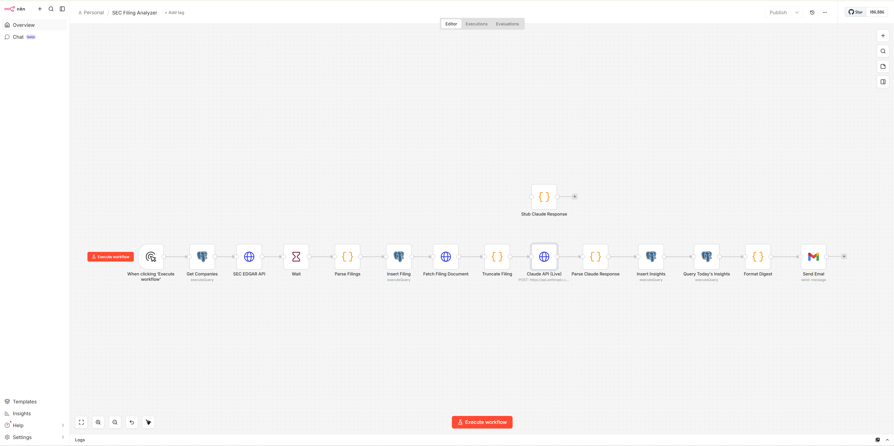
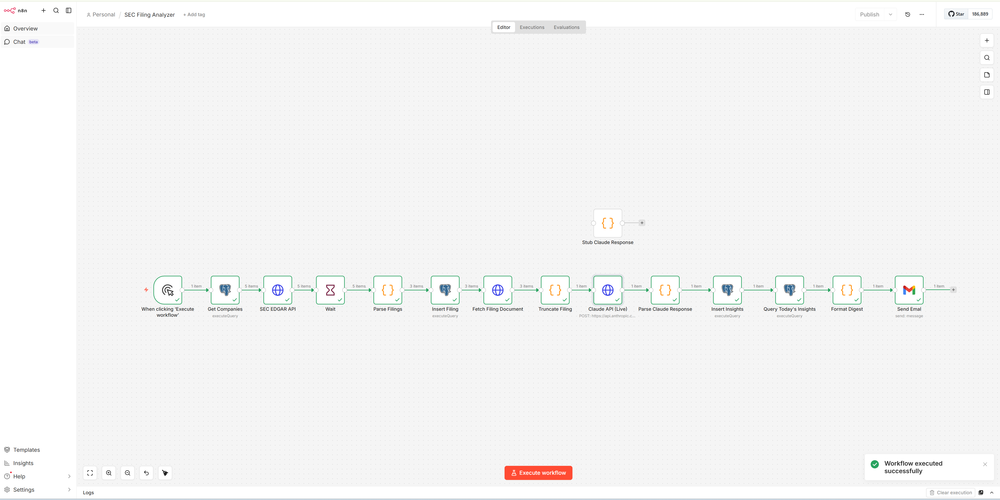

# SEC Filing Analyzer

An LLM-powered API orchestration pipeline that automatically pulls SEC EDGAR filings for aerospace/defense companies, analyzes them using the Claude API, stores structured insights in PostgreSQL, and delivers a formatted email digest.

## Architecture
Manual Trigger → Get Companies (PostgreSQL)
→ SEC EDGAR API → Parse Filings
→ Insert Filing → Fetch Filing Document → Truncate Filing
→ Claude API (LLM Analysis) → Parse Response → Insert Insights
→ Query Today's Insights → Format Digest → Send Email (Gmail)

## Tech Stack

- **Orchestration:** n8n (self-hosted, Docker)
- **LLM:** Claude API (Anthropic) for structured filing analysis
- **Database:** PostgreSQL — `sec_intel` schema with `company`, `filing`, and `filing_insight` tables
- **Data Source:** SEC EDGAR API (free, no auth)
- **Email:** Gmail integration for automated digest delivery
- **Infrastructure:** Docker, WSL2/Ubuntu

## What It Does

1. Queries 5 tracked aerospace/defense companies (Boeing, Lockheed Martin, RTX, Northrop Grumman, General Dynamics)
2. Pulls recent SEC filings (10-K, 10-Q, 8-K, DEF 14A) from the EDGAR API
3. Fetches and cleans the full filing document (strips XBRL/HTML, truncates for token limits)
4. Sends the filing text to Claude for structured analysis — extracting summary, financial highlights, key risks, contracts mentioned, workforce changes, and sentiment
5. Stores all metadata and insights in PostgreSQL
6. Formats and emails a daily digest with color-coded sentiment indicators

## Testing Strategy

Built with a **stub-first approach** to validate the full pipeline at zero cost before enabling live API calls:

- **Phase 1 (Free):** A stub Code node returns realistic hardcoded JSON, allowing end-to-end pipeline testing — database inserts, email formatting, and delivery — with no API spend.
- **Phase 2 (Live):** Swap the stub for the real Claude API node. The stub remains in the workflow as a disconnected fallback.

## Screenshots

### Workflow Design


### Live Execution (All Green)


## Database Schema

```sql
-- Tracked companies
sec_intel.company (company_id, cik, ticker, company_name, industry, sic_code)

-- Filing metadata from EDGAR
sec_intel.filing (filing_id, company_id, accession_number, form_type, filing_date, filing_url, primary_document)

-- LLM-generated insights
sec_intel.filing_insight (insight_id, filing_id, summary, key_risks, financial_highlights, contracts_mentioned, workforce_changes, sentiment, llm_model)
```

## Key Design Decisions

- **Manual triggers only** — no scheduled automation, no surprise API charges. Click to run, prove it works, done.
- **ON CONFLICT DO NOTHING** on filing inserts prevents duplicate processing on re-runs.
- **XBRL/HTML stripping and truncation** in the Truncate Filing node keeps token usage and costs predictable.
- **Raw body type** for the Claude API HTTP Request node — matches proven patterns from other n8n workflows and avoids JSON escaping issues with complex filing text.

## Cost

- SEC EDGAR API: Free
- n8n: Free (self-hosted)
- PostgreSQL: Free (local)
- Claude API: ~$0.10-0.30 per run (5 companies, depending on filing volume)
